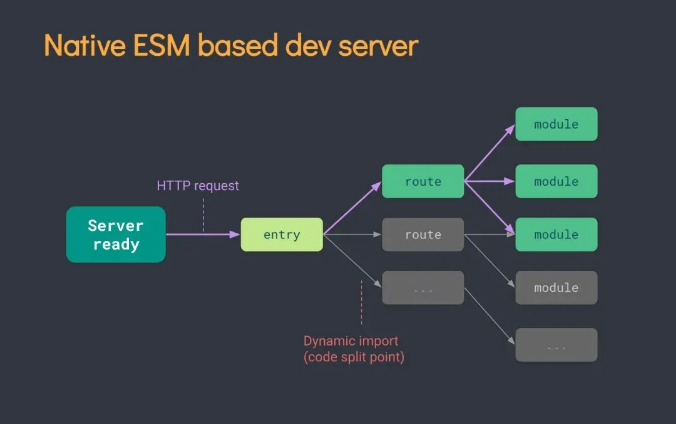
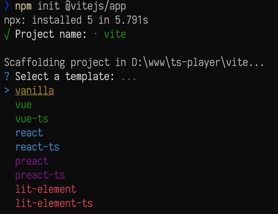

### 简介

[vite](https://cn.vitejs.dev/) —— 一个由 vue 作者尤雨溪开发的 web 开发工具，他基于浏览器原生 ES imports 的开发服务器。利用浏览器去解析 imports，在服务器端按需编译返回，完全跳过了打包这个概念，服务器随起随用。它具有以下特点：

1. 快速的冷启动
2. 即时的模块热更新
3. 真正的按需编译

### 原理

在过去的 Webpack、Rollup 等构建工具的时代，我们所写的代码一般都是基于 ES Module 规范，在文件之间通过 import 和 export 形成一个很大的依赖图。

这些构建工具在本地开发调试的时候，也都会提前把你的模块先打包成浏览器可读取的 js bundle，虽然有诸如路由懒加载等优化手段，但懒加载并不代表懒构建，Webpack 还是需要把你的异步路由用到的模块提前构建好。

当你的项目越来越大的时候，启动也难免变的越来越慢，甚至可能达到分钟级别。而 HMR 热更新也会达到好几秒的耗时。

<!--more-->

Vite 则别出心裁的利用了浏览器的[原生 ES Module 支持](https://developer.mozilla.org/zh-CN/docs/Web/JavaScript/Guide/Modules)，直接在 html 文件里写诸如这样的代码：

```html
// index.html
<div id="app"></div>
<script type="module">
  import { createApp } from 'vue'
  import Main from './Main.vue'

  createApp(Main).mount('#app')
</script>
```

Vite 会在本地帮你启动一个服务器，当浏览器读取到这个 html 文件之后，会在执行到 import 的时候才去向服务端发送 `Main.vue` 模块的请求，Vite 此时在利用内部的一系列黑魔法，包括 `Vue` 的 `template` 解析，代码的编译等等，解析成浏览器可以执行的 js 文件返回到浏览器端。

这就保证了只有在真正使用到这个模块的时候，浏览器才会请求并且解析这个模块，最大程度的做到了按需加载。

基于浏览器 `ES module` 来打包 web 应用还有[`snowpack`](https://www.snowpack.dev/)。不同的是, `vite` 对依赖预处理采用了 [`esbuild`](https://esbuild.github.io/) 打包——使用 Go 编写，并且比以 JavaScript 编写的打包器预构建依赖快 10-100 倍。

我们截取部分开发环境生成的代码:

```html
// index.html
<script type="module" src="/src/main.js"></script>
```
```javascript
// main.js
import { createApp } from '/node_modules/.vite/vue.js?v=0ec597b3'
import App from '/src/App.vue'

createApp(App).mount('#app')
```

#### 启动方式

原生 ESM 依赖时的链路图：



vite 只启动一台静态页面的服务器，对文件代码不打包，服务器会根据客户端的请求加载不同的模块处理，实现真正的按需加载。

一个特别典型的技术方案——skypack 的例子:

```html
<script type="module">
    import { h, Component, render } from 'https://cdn.skypack.dev/preact';
    import htm from 'https://cdn.skypack.dev/htm';
    const html = htm.bind(h);

    const app = html`<h1>Hello World!</h1>`;
    render(app, document.body);
  </script>
```

``对于热更新问题``，vite 采用立即编译当前修改文件的办法。同时 vite 还会使用缓存机制( http 缓存 => vite 内置缓存 )，加载更新后的文件内容。

所以，vite 具有了快速冷启动、按需编译、模块热更新等优良特质。

综上所述，vite 构建项目与 vue-cli 构建的项目在开发模式下还是有比较大的区别：

1. Vite 在开发模式下不需要打包可以直接运行，使用的是 ES6 的模块化加载规则；Vue-CLI 开发模式下必须对项目打包才可以运行。

2. Vite 基于缓存的热更新，Vue-CLI 基于 Webpack 的热更新。

### 上手步骤

当前官方文档已经很详细了


1. 编写`vite`配置文件`vite.config.js`, 使用`typescript`时为 `vite.config.ts`,这时需要 `tsconfig.ts`,可使用`vite-tsconfig-paths`来处理处理 typescript 路径映射
2. 编写入口文件 `index.html`, 注意要使用 ES Module 方式引入 `main.js` 或 `main.ts` 等逻辑代码入口


### 易于上手的插件

Vite 从 preact 的 WMR 中得到了启发，把插件机制做成兼容 Rollup 的格式。
目前和 vite 兼容或者内置的插件，可以查看[vite-rollup-plugins](https://vite-rollup-plugins.patak.dev/)。

### 官方`@vitejs/app`

当前官方`@vitejs`支持的模板有限，并且还[不支持Vue2](https://github.com/vitejs/vite/issues/305)。
```bash
npm init @vitejs/app
```
后会得到如图:




#### [vite-plugin-vue2](https://github.com/underfin/vite-plugin-vue2)

支持 vue2, 目前大部分的支持vue2的模板仓库都依赖此插件

#### `@rollup/plugin-alias`

在 `vite`，仍至下一版本的`vue-cli`，尤大都会建议在引入文件的同时要写下文件后缀([相关issue](https://github.com/vitejs/vite/issues/178))，不带文件后缀下 `vite`会报错找不到模块。

使用 `@rollup/plugin-alias` 后：

```javascript
import { defineConfig } from 'vite'
import vue from '@vitejs/plugin-vue'
import alias from '@rollup/plugin-alias';

// https://vitejs.dev/config/
export default defineConfig({
  plugins: [
    alias({
      entries: [
        { find: /@utils\/(.*)/, replacement: './utils/$1.js'},
        { find: /@\/components\/([^']*)/, replacement: './components/$1.vue'}
      ]
    }),
    vue()
  ]
})
```

#### [`vite-plugin-components`](https://github.com/antfu/vite-plugin-components)

这是个自动导入`components`组件的插件，还能配置多个ui组件库, 支持 Vue2 (基于vite-plugin-vue2) 和 Vue3，墙裂推荐

#### [`nuxt-vite`](https://github.com/nuxt/vite)

针对 `Nuxt` 项目的打包插件
在这里使用 `@rollup/plugin-alias` 和 `vite`的配置`alias`均无效, 只能在 `vscode` 中全局正则匹配替换来加上文件缀: 勾选 使用正式表达式 (Alt+R)
```text
@\/components\/([^']*)
@/components/$1.vue
```

#### [`vite-plugin-vue-gql`](https://github.com/jacobclevenger/vite-plugin-vue-gql) 

支持vue3和graphql语法声明

#### [vite-awesome](https://github.com/vitejs/awesome-vite)

每个框架和工具都应该有自己的Awesome，才算是合格的产品。

### 注意事项

1. 不可使用 `process.env`，而是使用 `import.meta.env` 来判断开发环境
2. [默认情况下，Vite 期望所有依赖项都运送 ES 模块，在这种情况下，有关依赖项使用 cjs 语法。](https://github.com/vitejs/vite/issues/135)
3. 对SSR的支持不足

### 相关阅读

1. [esbuild：一款快 10-100 倍的 JavaScript 打包 / 压缩工具推荐给你](https://zhuanlan.zhihu.com/p/112440861)
2. [浅谈 Vite 2.0 原理，依赖预编译，插件机制是如何兼容 Rollup 的？](https://zhuanlan.zhihu.com/p/352403391?utm_oi=44058902790144)
3. [如何看待 Web 开发构建工具 Vite？](https://www.zhihu.com/question/394062839/answer/1496127786?utm_oi=44058902790144)
4. [Vue3.0 + Vite 初体验（一）项目配置](https://segmentfault.com/a/1190000038999784)
5. [vue-cli 迁移 vite2 实践小结](https://zhuanlan.zhihu.com/p/353601634?utm_oi=44058902790144)
6. [Skypack 无需构建工具的CDN方式](https://www.skypack.dev/)
7. [Vite 依赖预编译，缩短数倍的冷启动时间](https://segmentfault.com/a/1190000039210683)
